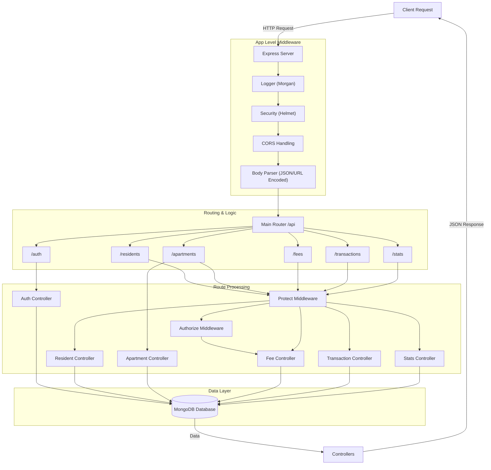
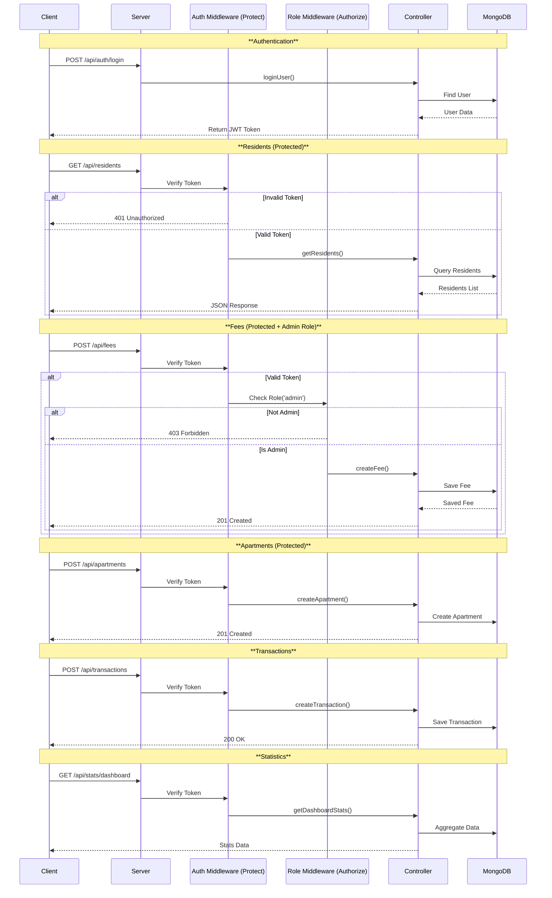

# API Flow Documentation

This document describes the operational flow of the BlueMoon Admin API using Mermaid diagrams.

## 1. General Request Lifecycle

This flowchart shows how a request is processed from the moment it hits the server until a response is returned.

## 2. Detailed API Routes Flow

The following sequence diagram illustrates the specific flows for the available endpoints, highlighting the middleware protection.

